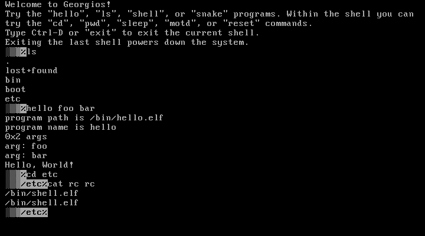

# Georgios

Georgios (Greek version of the name George, said like *GORE-GEE-OS*) is an
operating system I'm making for fun which currently targets i386/IA-32. The
purpose of this project is to serve as a learning experience.

Work in progress graphics mode:

https://user-images.githubusercontent.com/5941194/180702578-91270793-c91c-4f24-b7e1-f86bc2b48c53.mp4

## Features

### Working on at least some minimal level

- Kernel console that supports UTF-8 (specifically the subset needed for
  [Code page 437](https://en.wikipedia.org/wiki/Code_page_437) subset) and some
  basic ANSI escape codes
- Support for multiple mounted filesystems:
  - Ext2 accessed using an ATA Driver (read only)
  - In-memory filesystem mounted at boot (read/write)
- Basic preemptive multitasking between processes that can be loaded from ELF
  files
- ACPI shutdown using [ACPICA](https://www.acpica.org/)

### Started on, but not really working yet

- A graphics mode using VESA BIOS Extensions (VBE)
  - This will use [libx86emu](https://github.com/wfeldt/libx86emu) to
    invoke the BIOS code required to switch to VBE graphics modes. This doesn't
    really work yet though.
  - This can be bypassed with `make multiboot_vbe=true`, which has GRUB set a
    fixed VBE graphics mode. This is how the demo above was ran. This is not
    the default for a number of reasons:
      - The major reason is the graphics are slow. This can be seen in the
        demo, especially when the Apollo earthrise picture takes a moment to
        get drawn on the screen.
      - It's a fixed graphics mode when the kernel starts and so nothing gets
        printed to the screen until the graphical console is ready. So an error
        before this wouldn't get printed, which is a problem when running on
        real hardware.
      - The graphical console is mostly done but missing things like the cursor
        and text rendering is a bit off.
- USB 2.0 stack
- Porting real applications written in Zig and C
  - The applications currently written in Zig are "real" as in they are
    compiled and ran separately from the kernel, are running in x86 ring3, and
    can't take the whole system down (for the most part). The issue is they are
    compiled using the freestanding target. To be able to use a Zig or C hello
    world program without any modification, the standard libraries would have to be
    ported and toolchains would have to be modified to target Georgios properly.
- Freeing the OS from the need of a boot CD
- PS/2 Mouse support
  - Can be tried out by building with `make mouse=true` and running
    `test-mouse`. This isn't enabled by default becuase currently the keyboard
    and mouse cross talk when being used at the same time.

## Building

Building Georgios requires a Unix-like environment with:
- [Zig](https://ziglang.org/) 0.9.1
- Python 3
- GRUB2
  - Requires i686 Support (`grub-pc-bin` package on Ubuntu)
- xorriso (`xorriso` package on Ubuntu)

Georgios can be built as a bootable ISO (called `georgios.iso`) by running
`make`. If installed, QEMU and Bochs can be run by running `make qemu` or `make bochs`
respectively. On Ubuntu, Bochs requires `apt-get install bochs bochsbios
bochs-sdl bochs-x vgabios`.

For the moment it assumes the existence of an IDE disk with certain files on
it.

## Resources Used

- [OSDev Wiki](http://wiki.osdev.org/)
    - Very popular, fairly large set of resources in one place, but rough
      or just plain unhelpful in many places.
- [The little book about OS development](https://littleosbook.github.io/)
    - Polished, but limited intro into x86 OS development. Provided me with
      the initial start.
- [Intel x86 Software Development Manuals](https://software.intel.com/en-us/articles/intel-sdm)
- [xv6](https://github.com/mit-pdos/xv6-public)
- [The Design and Implementation of the 4.4 BSD Operating System](https://www.amazon.com/Implementation-Operating-paperback-Addison-wesley-Systems/dp/0132317923)
- [FYSOS: Media Storage Devices](https://www.amazon.com/dp/1514111888/)
